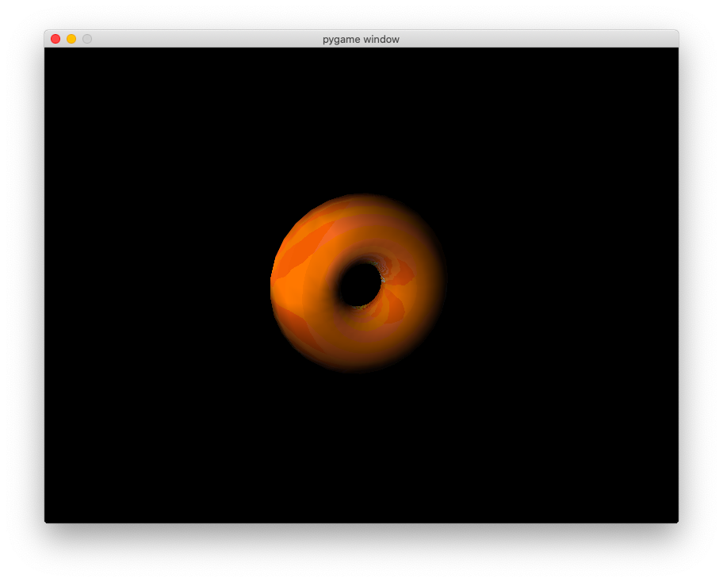

<h3 align="center">编程画一个真实感静态或动画景物</h3>
<p align="center">16307110216 何瑞安</p>

#### 一、程序说明

##### 1. 功能说明

我们使用OpenGL的接口绘制了一个具有橙色纹理的甜甜圈。

##### 2. 运行说明

本项目代码包含一个`main.py`文件、一个材质文件`texture.jpg`、一个文档`report.pdf`和一个演示视频`demo.mp4`，其中`main.py`是Python源代码，可以直接在Python环境中执行。

Python环境运行中请提前用`pip`安装`pyopengl`，`pygame`，`numpy`和`pillow`的包，然后运行`main.py`程序。演示视频的录制环境是 MacOS Catalina 10.15.7 (19H15)，Python 3.8.5。

请注意保证`texture.jpg`在当前目录下，否则会找不到材质文件。请保证本系统OpenGL接口兼容`pyopengl`库。

```bash
pip install pyopengl pygame numpy pillow 
python main.py
```

##### 3.实现说明

我们使用的`pyopengl`库最常见的绑定到OpenGL和相关API的跨平台Python库，它能够调用本系统的OpenGL接口进行绘图，并且兼容`pygame`等其他组件的调用。我们使用了OpenGL中预定义的甜甜圈图形，并且使用OpenGL提供的光照和纹理接口，对真实的甜甜圈进行绘制。

我们使用的`pygame`是一个免费的开源Python编程语言库，用于制作诸如游戏之类的多媒体应用程序。我们使用这个库构建窗体和主循环，能够使得OpenGL在预定的窗体中进行多帧绘图。

我们使用的`numpy`和`pillow`包用于加载材质图片并处理为`pyopengl`能处理的矩阵格式。



#### 二、算法原理

1. OpenGL 模型

图形学中3D模型有很多表示形式，网格（Mesh）就是一种它通过给定多边形（一般是三角形）的各个顶点三维坐标，然后绘制三角形获得一个立体图形。OpenGL中的默认模型都是这样的结构，调用它们时自动调用了绘制顶点和三角形的函数，这样就可以显示一个3D模型。我们使用的3D模型一般都会为每一个顶点定义一个法线方向，用于计算三角形中任意顶点的法线，并能够根据光源计算出反射的光。

2. OpenGL 纹理

纹理就是一张贴到物体上的二维图像，使用纹理图的时候，我们需要在顶点数据中添加一个纹理坐标的数据，标明我们是如何将纹理上的元素映射到顶点上的。我们使用`glGenTextures`创建纹理对象，`glTexParameterf`调整纹理参数，控制纹理如何填充以及匹配，`glTexGeni`可以自动为我们的图形生成纹理坐标，以便纹理映射。

3. OpenGL 光照

OpenGL中任何一个光源都可以发出不同强度的环境光、散射光、镜面反射光，这几个方面综合起来就决定了光源的颜色。OpenGL中光照通过`glLightfv`来设置属性，GL_DIFFUSE设置光的散射属性，GL_SPECULAR设置光源的镜面反射光属性，GL_POSITION设置光源的位置。最后我们使用`glEnable`来启用光源，得到我们想要的光照。

#### 三、参考文献

[1] Shreiner, Dave, et al. *OpenGL programming guide: The Official guide to learning OpenGL, version 4.3*. Addison-Wesley, 2013.

[2] Oliphant, Travis E. *A guide to NumPy*. Vol. 1. USA: Trelgol Publishing, 2006.